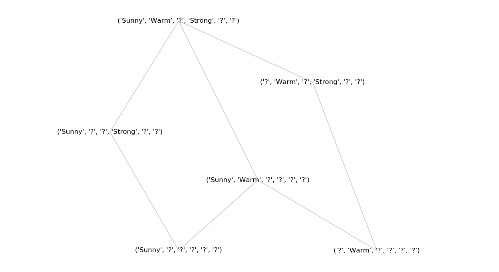

**Files** :
1. sample_data.py : File to give some sample data
2. FindS.py : Implementation of the Find-S Algorithm
3. CandidateElimination.py : Implementation of Candidate Elimination Algorithm
4. display_version_space.py : Draw the version space using networkx package

For the sports data in sample_data.py, the version space diagram generated by the file is :

