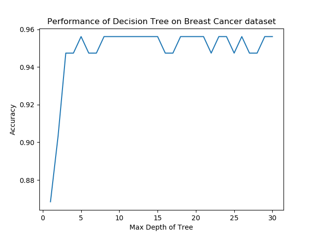
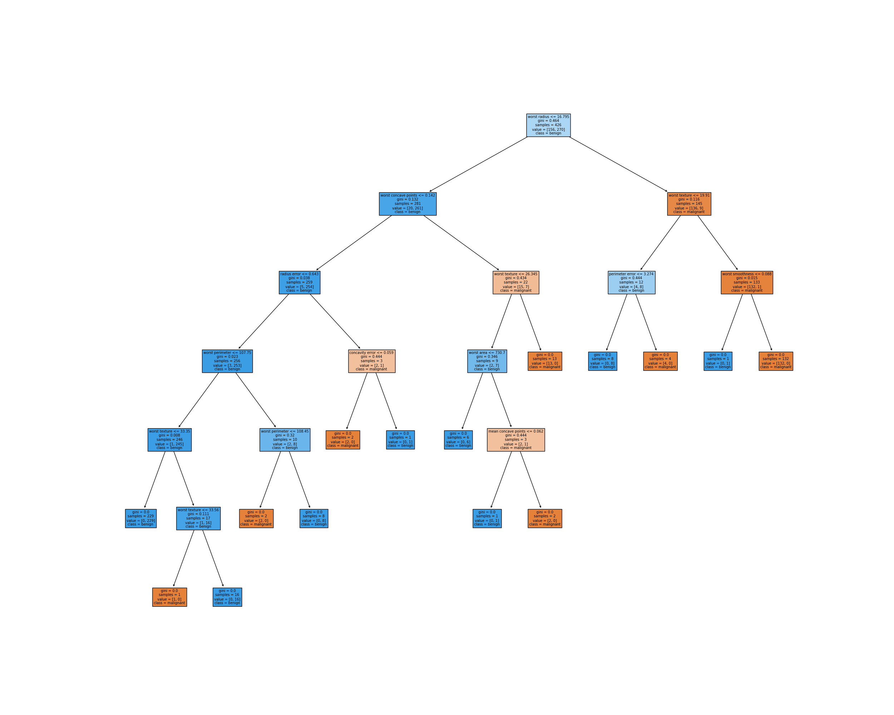

Two implementations of decision trees: The dataset used was the breast cancer dataset from sci-kit learn.

1. Self written : **decisiontree.py** 
   Performance : 
   

2. DecisionTreeClassifier() : From sklearn 
   Tree :
   
